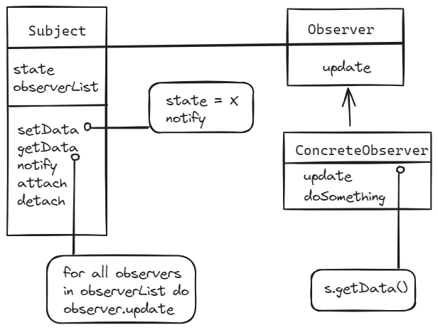
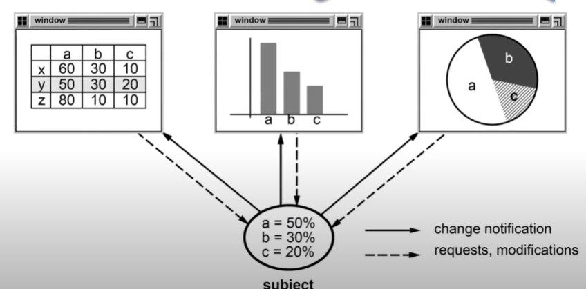
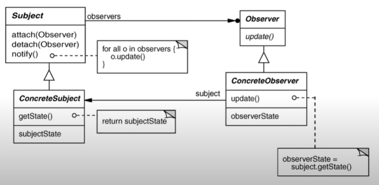
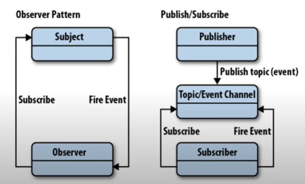

### Software Pattern

Describes a __solution__ to a common __problem__ arising within a __context__/__domain__ especially in object oriented programs although they are not limited to OOP.

Patterns help improve software quality & developer productivity by

- Naming recurring design structures
    > e.g the *Observer* pattern `defines a one to many dependency between objects so that when one object changes state, all dependents are notified & updated`
- __Specifying__ design structure explicitly by identifying key properties of classes & objects e.g,
    - Roles & Relationships
    - Dependencies
    - Interactions
    - Conventions

- __Abstracting__ from concete design elements
    > e.g problem domain, form factor, vendor, programing languages etc
- Distilling & codifying knowledge gleaned from the successful design experience of experts

#### Common Charateristics of Patterns

- Patterns describe both a thing & a process
    - The "thing" (the "what") typically means a particular high-level design outline or description of implementation details
    - The "process" (the "how") typically describes the steps to perform to create the "thing" 
- They can be independent of programming languages & implementation techniques
- They document/define "micro-architectures" - 
    -  In other words small clusters of classes and objects that re-occur (recurring designs)
    - Certain properties maybe modified for particular contexts
- The aren't code or concrete designs, so they must be redefined & applied in particular languages
- They are not methods, but can be used as an adjunct to methods
    - Rational Unified Process
    - Agile
    - Others
- There are also patterns for conducting requirements analysis, organizing agile software development teams & dealing with other complex settings

#### Common Parts of a Pattern Description
- Name
    - Should be pithy & memorable
        > **Observer**
- Intent
    - Goal behind the pattern & the reason(s) for using it
        > __Observer__: Define a one to many dependency between objects so that when one object changes state, all dependents are notified and updated
- Problem
    - Motivation "forces" & situations in which pattern is applicable
        > - An abstraction has at least 2 aspects, one depends on the other
        > - A change to one object requires change untold others
        > - An object should notify unknown other objects
        > 
        >
- Solution provided by the pattern
    - Visual & textual descriptions of the static structure, participants, & collaboration dynamics of a pattern
    
- Example implementation guidance
    - e.g. source code snippets in one or more programming languages
- Consequences
    - Benefits & Liabilities of applying the pattern
        > `+` Modularity: Subjects & Objservers may vary independently
        
        > `+` Extensibility: Can define & add any number of observers'

        > `+` Customizability: Different observers offer different views of subject

        > `-` Unexpected updates: Observers don't know about each other

        > `-` Update overhead: Might need hints or filtering
- Known Uses
    - Example of real pattern uses
        > For observer
        > - Smalltalk Model View Controller(MVC)
        > - InterViews
        > - Java Observer/Observable
        > - Pub/Sub middleware (e.g. CORBA Notification Service, Data Distribution Service, Java Message Service)
        > - Mailing List
- Related Patterns
    - Summarize relationships & tradeoffs between alternative patterns for similar problems
    

### Pattern Relationships

-  Pattern Compliments
    - One pattern provides missing ingredient needed by another
        > Factory Method with Disposal Method
    - One pattern contrasts w/ anohter to provide alternative solution to a related design problem
        > Iterator pattern vs Batch pattern
- Pattern Compound
    - Patterns that occur frequently enough together that it warrants thinking about them as a single solution to a common design problem
        > Composite with Command
- Pattern Sequence
    - Join predecessor patterns with successor patterns to form part of thier context
- Pattern Language
    - Network of related patterns that define a process for the orderly resolution of key development problems in particular domains
        >

### SCV Analysis

Domain Scope Commonality & Variability (SCV) analysis as a means to achieve systematic sofware reuse

